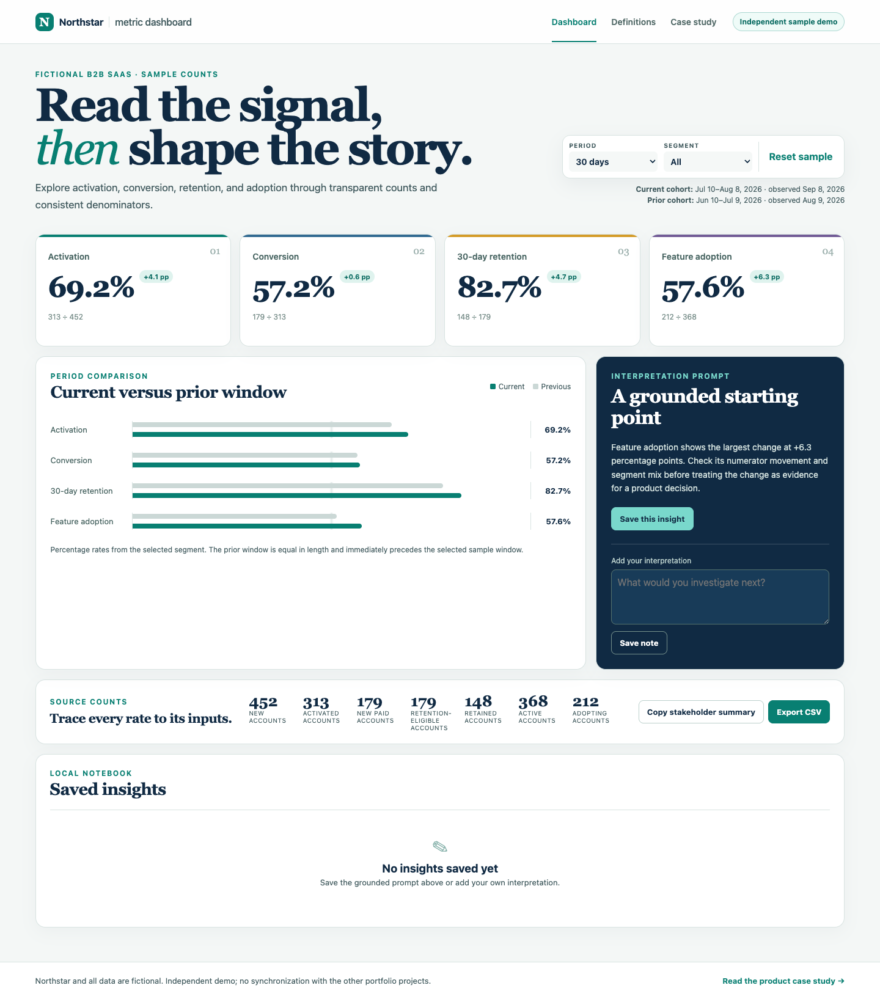

# Metric Dashboard

**[Try the live demo](https://mvahedi2020.github.io/Metric-Dashboard/)** · [Watch the workflow](docs/media/workflow.webm) · [Read the case study](docs/product/Case_Study.md)

An independent product sample for turning metric review into a traceable decision workflow. It uses coherent fictional account counts for Northstar, a fictional B2B SaaS company, and keeps each rate close to its numerator, denominator, time window, and comparison.

## Scenario

A product lead needs to compare activation, conversion, 30-day retention, and role-template adoption across company segments. They filter a 30- or 90-day acquisition cohort, inspect current and prior rates, trace each result to source counts, save scoped interpretation notes, export the selected view, and copy a stakeholder-ready summary.

The current 30-day cohort runs Jul 10–Aug 8, 2026 and is observed Sep 8, giving every retention-eligible paid account a full 30-day follow-up. The comparison cohort runs Jun 10–Jul 9 and is observed Aug 9. The product labels empty data as unavailable rather than presenting a misleading 0%.

## My role

As Product Manager, I own the product problem, metric contracts, segmentation model, comparison design, analysis flow, evidence boundaries, sample dataset, requirements, and validation plan. Google Antigravity and other AI tools assisted with implementation and verification. No business result, customer finding, or independent AI product decision is claimed.

## Product decisions and tradeoffs

1. **Counts before rates.** Segment totals are summed before calculating percentages, and every card exposes its source counts. This takes more space than a KPI-only view but prevents hidden or unweighted denominators.
2. **Cohort-safe retention.** Retention uses a distinct eligible-paid denominator and cohort windows that end 30 days before observation. The sample therefore avoids partial follow-up, at the cost of being less “fresh” than a naïve current-period rate.
3. **Interpretation as a prompt, not a verdict.** The dashboard identifies the largest rate change and asks what evidence could explain it. It does not rank unlike funnels as if the lowest percentage were automatically the highest priority.

## PM decision brief

The primary user is a product lead preparing an operating review. The immediate job is to decide which signal deserves investigation, explain what is known, and leave a scoped follow-up for the next review. The dashboard supports a reasoned investigation before a roadmap decision.

- **Decision:** choose the next metric or segment to investigate.
- **Evidence:** inspect the numerator, denominator, cohort dates, segment mix, and percentage-point change before writing an interpretation.
- **Tradeoff:** prefer a slightly older, fully observed cohort over a fresher but incomplete retention rate.
- **Follow-up:** save a hypothesis or question with its filter scope, then share the fictional sample summary for review.
- **Escalation:** treat a large change as a prompt for product, data, or customer evidence; do not infer causality from this dashboard alone.

## Limitations

Northstar and all figures are fictional. There is no live source, freshness claim, user research, experiment result, sprint status, Slack integration, authentication, analytics, or measured outcome. Saved insights use versioned browser storage on one device; the interface warns when it is unavailable and offers a reset. A production dashboard would require governed event definitions, late-arriving-data rules, identity resolution, access control, auditability, and an accountable review cadence.

## Product documentation

- [Case Study](docs/product/Case_Study.md)
- [Product Requirements](docs/product/PRD.md)
- [GTM Strategy](docs/product/GTM_Strategy.md)
- [Sprint Backlog](docs/product/Sprint_Backlog.md)
- [Validation Plan](docs/product/Validation.md)
- [PM decision brief and prioritization](docs/product/PRD.md#pm-decision-framework)
- [Exhaustive interaction and recovery matrix](docs/product/Control_Matrix.md)
- [Contributing and technical setup](CONTRIBUTING.md)

Licensed under the [MIT License](LICENSE).
